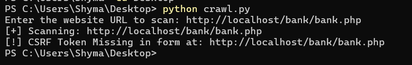

# CSRF Vulnerability Crawler and Research

A Python-based tool that crawls websites, detects HTML forms, and checks for missing CSRF tokens.  
This project was created for **educational and research purposes** to demonstrate how easily overlooked CSRF vulnerabilities can be detected using automation.  

---

## 🧠 Overview

Cross-Site Request Forgery (CSRF) is a common web vulnerability that allows attackers to perform unauthorized actions on behalf of authenticated users.  
This crawler automates the process of finding forms that might be missing CSRF protection fields.

---

## ⚙️ Features

- Crawls through pages up to a specified depth  
- Detects all forms on each page  
- Checks if a CSRF token field is missing  
- Prints clear alerts in the console for potential vulnerabilities  
- Easy to modify and expand for deeper security analysis  

---

## 📁 Files Included

- `crawl.py` → Main crawler script (Python)  
- `index.html` → Proof of Concept
- `README.md` → Project documentation (this file)  

---
## Implementation

I developed a PHP-based demonstration that simulates a bank transaction webpage intentionally lacking CSRF protection. The proof-of-concept illustrates how an attacker could exploit the missing token to perform unauthorized transactions. The demo is intended to be run locally using XAMPP; relevant screenshots are included below.

### Detection heuristic 

The crawler uses a simple heuristic: it flags forms as protected only if they contain an `<input>` element whose `name` includes the substring `"csrf"` (case-insensitive).  
**Limitations:** this is a narrow check and may miss valid CSRF protections that use different field names, tokens injected by JavaScript, cookie-based protections (double-submit), or framework-specific names. Treat results as indicators for manual follow-up, not definitive proof.

